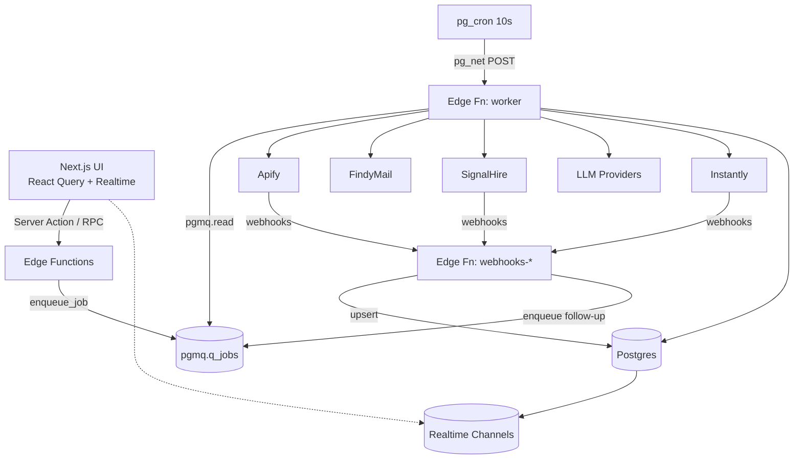
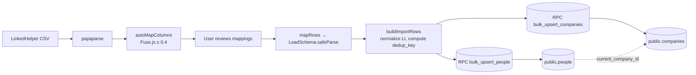

# Architecture

## System diagram

## CSV import pipeline (Sprint 2)

People and companies are **global** (no `org_id`). RLS makes both tables read-all for authenticated users; writes are gated through `SECURITY DEFINER` RPCs that assert `auth.uid() is not null`. Dedup happens server-side via `ON CONFLICT (linkedin_url) DO UPDATE` + a secondary pass on `dedup_key = sha256(lower(first_name||last_name||domain))` for rows missing a LinkedIn URL. Existing fields are preserved via `coalesce(existing, incoming)`; `data_json` merges with `||` so enrichment runs never clobber each other.

Chunk size: 500 rows per RPC call. Max upload: 100k rows / 25MB.

## Clay-style grid (Sprint 2)

- **Virtualized both axes** via `@tanstack/react-virtual` — row virtualizer only; column virtualization deferred since LinkedHelper fits ≤ 30 columns on screen. Row height fixed at 40px.
- **Infinite load** — 100-row pages via React range queries as the scroller approaches the bottom.
- **Realtime** — `useRealtimeTable` subscribes to `postgres_changes` on people/companies and merges updates (debounced 300ms) only into rows already on screen. RLS is our safety net against cross-org leaks.
- **Inline edits** — whitelisted columns (`first_name`, `last_name`, `full_name`, `current_title`, `location`, `country`) go through `update_person_fields` RPC. Anything else is read-only until the custom-fields UI ships in Sprint 3.

## Layers

### 1. UI (Next.js 15)
- **Server Components** by default. Mark client only for interaction/state.
- **Server Actions** for mutations. Every action validates input with zod before calling Supabase.
- **React Query** owns client-side cache. Realtime hook pushes updates via Supabase channels.
- **Route groups**: `(auth)` unauthenticated, `(dashboard)` authenticated.

### 2. Data (Supabase Postgres)
- Multi-tenant model ready: `organizations` + `memberships`. Today single-user.
- Global entities: `people`, `companies`, `emails` — shared across clients, enriched once, reused.
- Per-client entities: `audiences`, `campaigns`, `people_in_campaign`, `message_sequences`, `prompts`.
- Audit: `enrichments`, `cost_tracking`, `job_runs`, `webhooks_log`.
- RLS everywhere. Cross-org access impossible at the DB layer.

### 3. Background jobs (pgmq + pg_cron + pg_net + Edge Fn `worker`)
- UI enqueues via `enqueue_job(p_type, p_payload, p_org_id)` RPC (security definer, org-gated).
- `pg_cron` fires every 10s → `pg_net` POSTs to `/functions/v1/worker`.
- `worker` reads ≤5 messages with VT=420s, dispatches on `message.type`, deletes on success, sets VT for retry on error, DLQs after 5 attempts.
- Each job writes `job_runs` start + end with cost.

### 4. Webhooks (Edge Functions)
- `webhooks-apify` — verifies `?secret=`, upserts dataset, enqueues next step.
- `webhooks-instantly` — verifies bearer token, writes `replies`, updates `people_in_campaign`.
- `webhooks-signalhire` — verifies `?secret=`, writes emails + enqueues `verify_email_instantly`.
- All webhooks dedupe on `(provider, event_id)` via `webhooks_log`.

### 5. Integrations layer (`src/lib/integrations/`)
- One folder per provider. Each exports a typed client + zod schemas.
- Retries, cost accounting, mock mode behind a single shared `fetchWithRetry`.
- UI and Server Actions **never** call integrations directly — always via the queue.

### 6. AI layer (`src/lib/ai/`)
- Vercel AI SDK v5 provider registry.
- `callLLM<Schema>(...)` unified entry point. Returns `{data, usage, costUsd, latencyMs}`.
- Hard-coded pricing table in `pricing.ts`; reconciled against provider invoices monthly.

## Folder layout
See `CLAUDE.md` for the full tree. Key conventions:
- `src/app/` — routes only. No business logic.
- `src/lib/` — business logic, integrations, schemas.
- `src/components/ui/` — shadcn primitives (generated).
- `src/components/features/` — feature-specific compositions.
- `src/components/layout/` — sidebar, topbar.
- `src/hooks/` — reusable client hooks.

## Request lifecycle (Server Action example)
1. Client form → `"use server"` action.
2. Action calls `schema.safeParse(input)` — reject on fail.
3. Action reads session via `createServerClient().auth.getUser()`.
4. Action inserts/updates via `supabase.from(...)` — RLS enforced.
5. For heavy work: `supabase.rpc('enqueue_job', {...})`. Returns immediately.
6. `revalidatePath(...)` or `revalidateTag(...)` to refresh Server Component caches.

## Deployment
- **Vercel**: `main` → Production, all other branches → Preview.
- **Supabase**: one production project; a second "test" project for Playwright.
- Migrations applied via `supabase db push` from a trusted developer machine (never from CI auto-push).
- Edge Functions deployed via `pnpm run functions:deploy`.
- Env vars configured in Vercel dashboard — matching `.env.example`.

## Observability
- `/jobs` page — live view of `job_runs` via Realtime subscription. Queue depth via `queue_health()` RPC.
- `enrichments` table is the system-of-record for every external API call — provider, endpoint, cost, latency, error.
- `cost_tracking` is the rollup — used by the analytics dashboard.
- Errors logged with structured JSON (`logger.error({event, error, ctx})`); consumed by Vercel logs.
